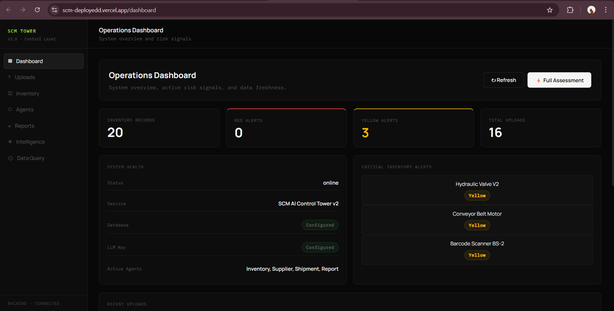
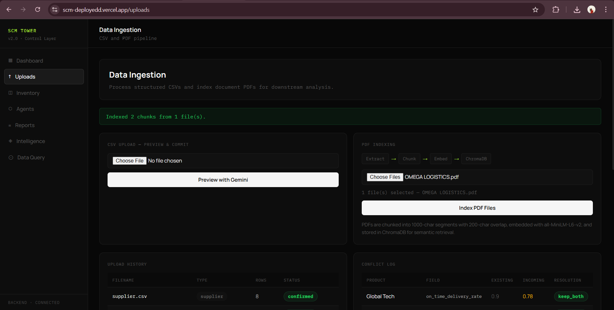
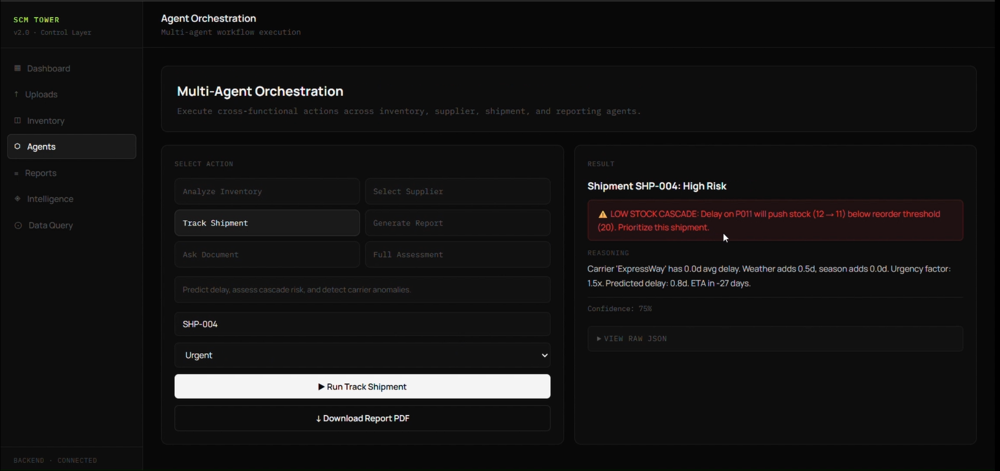

# 🏭✨ SCM AI Control Tower 🚀

> Agentic AI for supply chain intelligence — because your supply chain deserves better than a spreadsheet. 💀

SCM AI Control Tower connects the dots your existing tools never could. Delayed shipment + low stock = stockout predicted automatically before it happens. Upload any CSV in any format. Ask your supplier contracts questions in plain English. Get a full executive report in 10 seconds. 🔥

**Live:** [scm-deployedd.vercel.app](https://scm-deployedd.vercel.app)

---

## 🚀 Features & Superpowers

⚡ **Smart CSV Ingestion** — Upload literally any CSV format. No templates, no reformatting. AI maps your weird column headers automatically, detects conflicts field by field, and nothing touches the database without your confirmation.

💥 **Cascade Risk Detection** — The headline feature. When a shipment is delayed the system automatically checks if stock will run out before the restock arrives. If yes — CASCADE RISK: CRITICAL. No other affordable supply chain tool does this automatically.

🤖 **Multi-Agent Intelligence** — Five specialized agents, pure Python, no LangChain agent framework:
- 📦 **Inventory Agent** — EOQ, safety stock, reorder point, days until stockout
- 🏪 **Supplier Agent** — Dynamic weighted scoring that shifts based on urgency
- 🚚 **Shipment Agent** — Delay risk scoring + cascade detection
- 📊 **Report Agent** — KPIs, root cause analysis, 14-day projections, PDF export
- 🔥 **Full Assessment** — One button, all four agents, complete supply chain picture

📄 **RAG Document Intelligence** — Upload supplier contracts and SLAs. Ask questions in plain English. Every answer comes with source chunks, page numbers, ROUGE/BLEU scores, and automatic faithfulness evaluation that flags hallucinations.

📈 **Automated Reporting** — KPIs, root cause analysis, 14-day stockout projections, executive summary — all in a formatted downloadable PDF. One button, 10 seconds.

💡 **Data Query** — Ask questions about your live inventory in plain English. "Which products will stockout in 7 days?" — answered instantly.

---

## 💡 Why SCM AI Control Tower?

Every system alerts you when stock hits a threshold. Nobody automatically connects a delayed shipment to a future stockout by cross-referencing shipment lead times against current inventory consumption rates in real time.

That's the gap. That's what we built. 🔥

---

## 🖼️ Sneak Peek

| Dashboard | Uploads | Cascade Risk |
|-----------|---------|--------------|
|  |  |  |

---

## 🧠 Agent Formulas
```python
# Inventory Agent — pure Python, no LLM
EOQ              = √(2 × annual_demand × ordering_cost / holding_cost)
Safety Stock     = 1.645 × std_dev × √lead_time  # 95% service level
Reorder Point    = (avg_daily_consumption × lead_time) + safety_stock
Days to Stockout = current_stock / avg_daily_consumption

# Supplier Agent — weights shift by urgency
Normal:    On-time 35% | Quality 25% | Cost 25% | Reliability 15%
Urgent:    On-time 50% | Quality 25% | Cost 15% | Reliability 10%
Immediate: On-time 60% | Quality 25% | Cost 10% | Reliability  5%
True Cost = base_cost×qty + urgency_premium + carrying_cost + risk_penalty

# Shipment Agent
Delay Risk = (days_overdue×0.4) + (carrier_late_rate×0.3) + (supplier_issue_rate×0.3)
Cascade    = days_of_stock_remaining < lead_time_days → CRITICAL

# Report Agent
Inventory Health = (products_above_reorder / total) × 100
On-Time Rate     = (on_time_shipments / total) × 100
Supplier Health  = avg(on_time×0.5 + quality×0.3 + issue_penalty×0.2) × 100
```

---

## ⚡ Getting Started
```bash
# Backend
cd scm
pip install -r requirements.txt

# .env
GOOGLE_API_KEY=your_gemini_key
DATABASE_URL=your_postgres_url

uvicorn main:app --reload
```
```bash
# Frontend
cd scm_frontend
npm install

# .env.local
NEXT_PUBLIC_API_BASE=http://localhost:8000

npm run dev
```

---

## 🛠️ Tech Stack

| Layer | Tech |
|-------|------|
| Frontend | Next.js, TypeScript, Tailwind CSS |
| Backend | FastAPI, Python 3.11 |
| Database | PostgreSQL + SQLAlchemy async |
| Vector Store | ChromaDB (persistent) |
| LLM | Gemini 2.5 Flash Lite |
| Embeddings | Gemini text-embedding-004 |
| PDF Generation | ReportLab |
| Deployment | Render + Vercel |

---

## 🌸 Other Projects

- [**interview-copilot**](https://github.com/anwexhaa/interview-copilot) — Realtime AI workspace for interview prep with Blind 75 tracker
- [**astramind**](https://github.com/anwexhaa/astramind) — AI-driven financial report intelligence
- [**second-brain**](https://github.com/anwexhaa/second-brain) — AI knowledge base with RAG and semantic search
- [**mindmapme**](https://github.com/anwexhaa/mindmapme) — Minimal mood tracker and journaling app

---

*Built with Python, FastAPI, Next.js, Gemini, PostgreSQL, and ChromaDB.* 🔥
